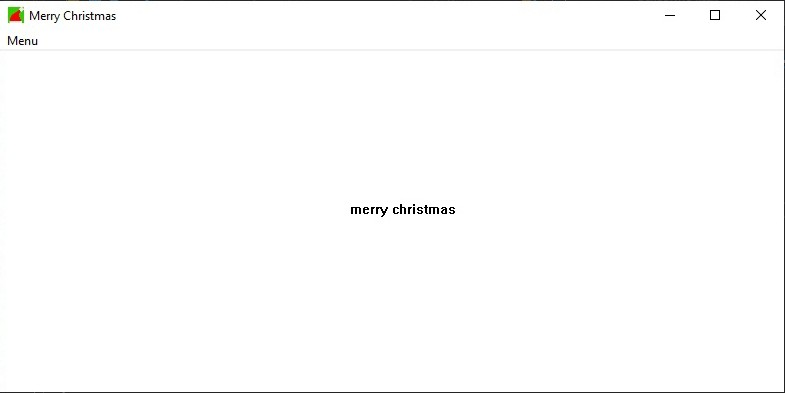
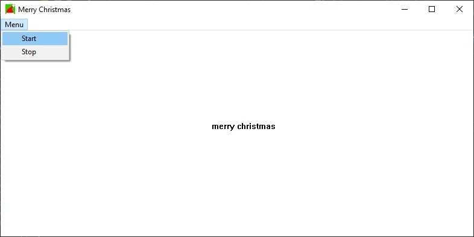
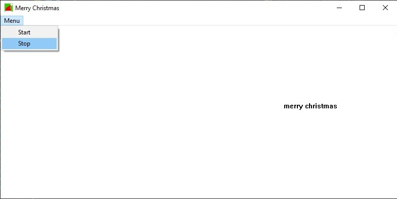

## Условие задания:
Реализация бегущей строки с управлением элементами управления Button: создаются кнопки Start и Stop, при нажатии на кнопку Start в окне
должна появиться движущаяся надпись, после этого кнопка Stop должна приостанавливать движение надписи, а кнопка Start – возобновлять его
(используется таймер и обработчик сообщения WM_PAINT).

## Выполнение программы:

### Примечание: курсор почему-то не видет на картинках 

Ответ на теоритический вопрос находится в файле Theoretical task.txt
