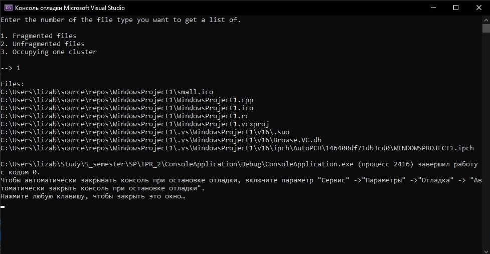
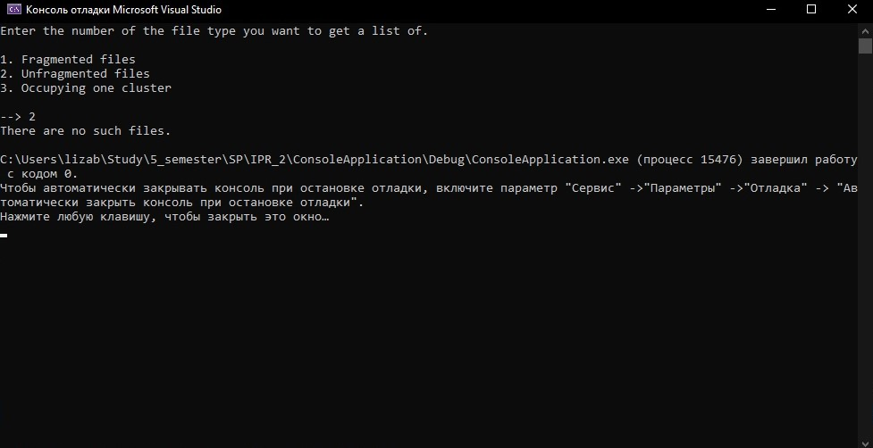
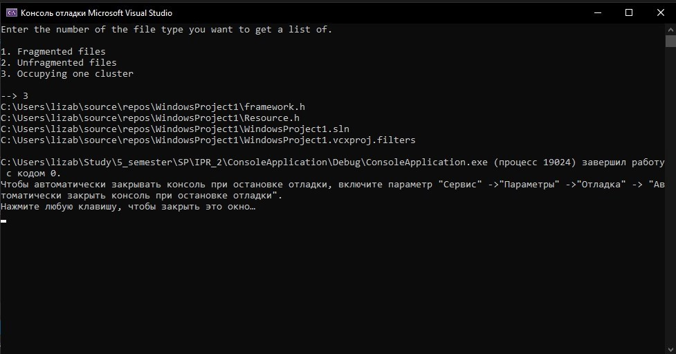
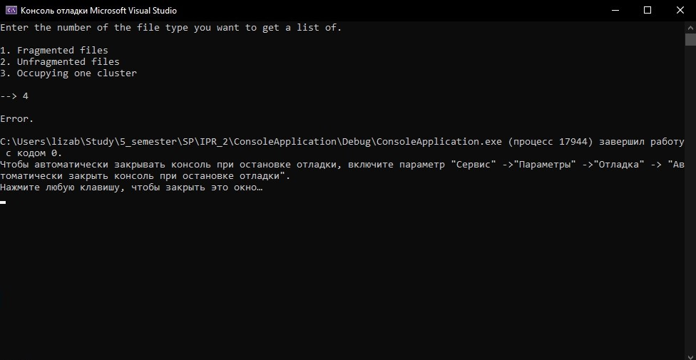

Ответ на теоритический вопрос находится в файле Theoretical task.txt

# Условие задания:
Формирование списков файлов: фрагментированных, нефрагментированных, занимающих строго один кластер. (Файл считается
нефрагментированным, если кластера, которые для него выделены, следуют подряд по порядку их номеров.) 

# Выполнение программы:

### Примечание:
